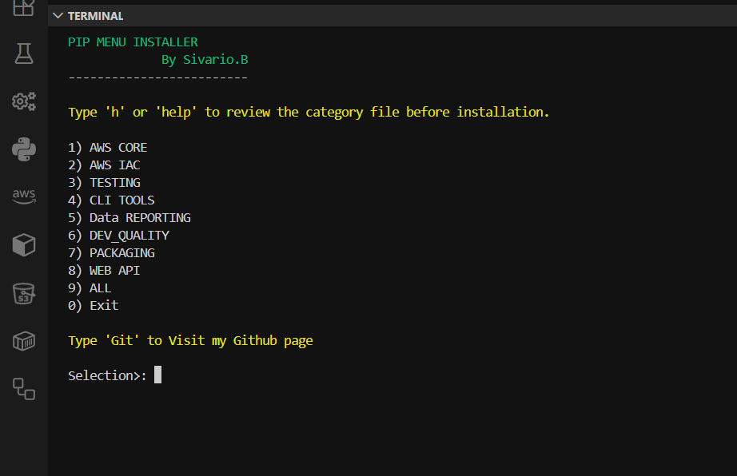
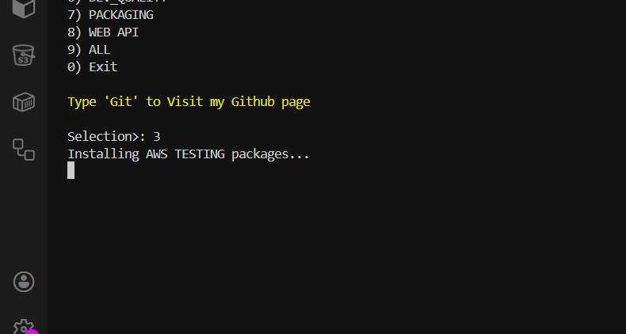
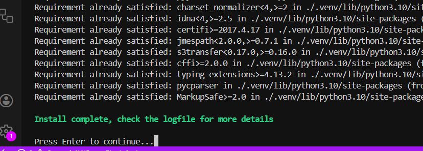
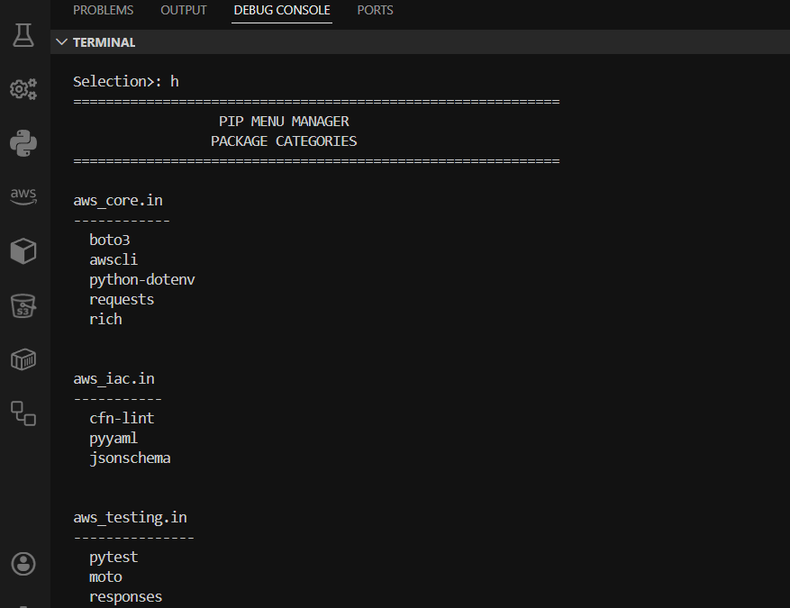

# Pip Automated Package Manager

A structured, Bash-based Python environment installer designed to automate categorized dependency management for AWS automation, DevOps workflows, CLI tooling, API services, and data/reporting environments.

This tool standardizes Python environment setup by installing curated package groups into an isolated virtual environment, reducing manual configuration and improving consistency across development setups.

## Table of Contents

# Overview

---

- Features

- Project Structure

- Package Categories

- Installation

- Usage

- Logging

- Dependency Locking (Optional)

- Requirements

- Design Principles

- License

----

# Overview



The Pip Automated Package Manager provides a controlled, modular system for installing categorized Python packages. Instead of manually installing individual libraries, users select predefined categories aligned with specific engineering workflows.

# The system automatically:

Creates a virtual environment if it does not exist

Installs selected package groups

Displays installation progress

Logs installation output for auditing

Supports optional dependency locking for reproducibility

This project demonstrates practical Bash scripting, dependency orchestration, and environment automation.

# Features

Categorized package management

Automatic virtual environment creation

Live terminal feedback during installation

Persistent logging of all installation activity

Modular configuration via category files

Optional reproducible dependency locking

Linux and WSL compatible

# Project Structure
```
pip_menu.sh
packages/
    aws_core.in
    aws_iac.in
    aws_testing.in
    dev_quality.in
    cli_tools.in
    web_api.in
    data_reporting.in
locks/                  # Optional (generated pinned dependencies)
logfile/
```



# Package Categories

Each .in file inside the packages/ directory defines a curated group of related tools.

aws_core.in

# Core AWS automation and cloud interaction tools.

```
boto3

awscli

python-dotenv

requests

rich

```
# Primary use cases:

AWS service automation

IAM management

Lambda workflows

Cloud scripting

aws_iac.in

Infrastructure as Code validation and configuration tools.
```
cfn-lint

pyyaml

jsonschema
```
# Primary use cases:

CloudFormation template validation

Infrastructure validation

Configuration integrity checks

aws_testing.in

Testing and AWS service mocking tools.
```
pytest

moto

responses

freezegun
```
# Primary use cases:

Testing AWS automation safely

Mocking AWS services

Unit testing infrastructure logic

dev_quality.in

Code quality enforcement and development workflow tools.

```
ruff

mypy

pytest

pytest-cov

pre-commit
```
# Primary use cases:

Static analysis

Type validation

Code linting

CI/CD readiness

Pre-commit enforcement

cli_tools.in

Command-line interface development tools.
```
typer

click

rich
```
# Primary use cases:

Building structured CLI tools

Automation utilities

DevOps scripts

web_api.in

Backend API and service development tools.
```
fastapi

uvicorn

requests

pydantic
```
# Primary use cases:

Webhook handlers

Internal automation APIs

Service-based automation endpoints

data_reporting.in

Data processing and reporting tools.
```
pandas

numpy

matplotlib

openpyxl
```
# Primary use cases:

Log analysis

AWS cost reporting

Metrics processing

Data export and visualization




# Help Menu to list packages




# Installation

Clone the repository:
```
git clone https://github.com/your-username/pip_automated_package_manager.git
cd pip_automated_package_manager
```

Make the installer executable:
```
chmod +x pip_menu.sh
```

Run the installer:
```
./pip_menu.sh
```
# Usage

Launch the installer script.

Select the desired package category.

The script creates a virtual environment (.venv) if it does not already exist.

The selected packages are installed into the isolated environment.

Installation output is displayed in real time and recorded in log files.

Logging

# All installation activity is recorded in the logfile/ directory:

logfile/venv_creation.txt
logfile/installed.txt
logfile/all_installed.txt


Logs provide traceability, auditing capability, and troubleshooting support.

# Dependency Locking (Still working on it)

For reproducible environments, .in files can be compiled into fully pinned dependency lock files using pip-tools.
Just to make sure we get the updated versions 

Install pip-tools:
```
python -m pip install --upgrade pip pip-tools
```

# Requirements

Linux or WSL environment

Python 3.8 or higher

Bash shell

Internet access for package installation

License


This project is provided for educational and automation purposes. Modify and adapt as needed for your development environment.
